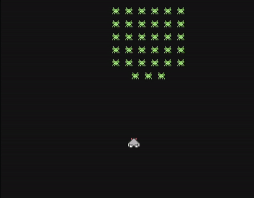

# :rocket: Space Invaders Game

This is a simple implementation of the classic Space Invaders game using **C++** and the **SDL2** library. The purpose of this project is to provide a fun way to practice **C++ programming** and familiarize myself with game development concepts.

## :computer: Getting Started

### Using Visual Studio

1. Clone the repository or download the source code files.
2. Open the Space Invaders project folder in Visual Studio.
3. Make sure you have the **SDL2 libraries** installed on your system.
4. In Visual Studio, go to **Project** > **Properties**.
5. In the project properties, go to **Configuration Properties** > **VC++ Directories**.
6. Edit the **Include Directories** and **Library Directories** to specify the paths to your SDL2 installation.
7. Build the project by pressing **Ctrl+Shift+B** or selecting **Build** > **Build Solution**.
8. Run the game by pressing **Ctrl+F5** or selecting **Debug** > **Start Without Debugging**.

### Manual Compilation

If you prefer to compile the project manually, follow these steps:

1. Clone the repository or download the source code files.
2. Make sure you have the **SDL2 libraries** installed on your system.
3. Open a terminal or command prompt and navigate to the project directory.
4. Compile the source code using the following command:

   ```shell
   g++ main.cpp -o space_invaders -lSDL2 -lSDL2_image
   ```

   If you are using a different compiler, adjust the command accordingly.

5. Run the game:

   ```shell
   ./space_invaders
   ```

## :video_game: Gameplay

The objective of Space Invaders is to destroy a fleet of aliens while avoiding their projectiles and preventing the aliens from reaching the bottom of the screen.
sad
- Move the spaceship using the A and D keys or the Left and Right arrows. <!-- Add left and right arrow keys as well -->
- Shoot by pressing the spacebar.
- Destroy all aliens to win the game.
- If any alien reaches the bottom of the screen or collides with the spaceship, the game is over.
<!-- 
## :art: Customization

Feel free to customize and enhance the game according to your preferences and learning goals. Here are some suggestions:

- Add sound effects and background music using the **SDL2_mixer** library.
- Implement different levels with increasing difficulty.
- Introduce power-ups or additional obstacles.
- Improve the graphics and visual effects.
- Implement a scoring system or high-score tracking.
 -->
 
## :hourglass_flowing_sand: Progress


## :books: Resources

- [SDL2 Documentation](https://wiki.libsdl.org/)
- [SDL2_image Documentation](https://wiki.libsdl.org/SDL2_image/FrontPage)
- [Lazy Foo' Productions SDL2 tutorials](https://lazyfoo.net/tutorials/SDL/index.php)
- [How To Make A Game In C++ & SDL2 From Scratch! by Let's Make Games](https://youtube.com/playlist?list=PLhfAbcv9cehhkG7ZQK0nfIGJC_C-wSLrx)

## :page_facing_up: License

This project is licensed under the **MIT License**. Feel free to use and modify the code for personal or educational purposes.
